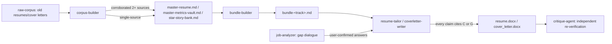
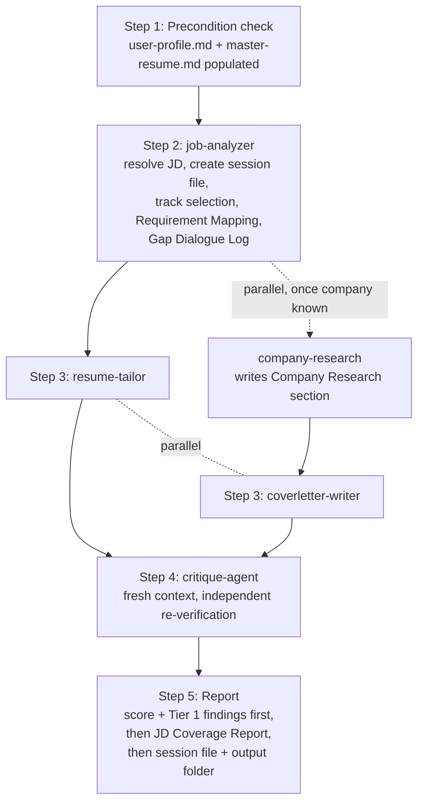
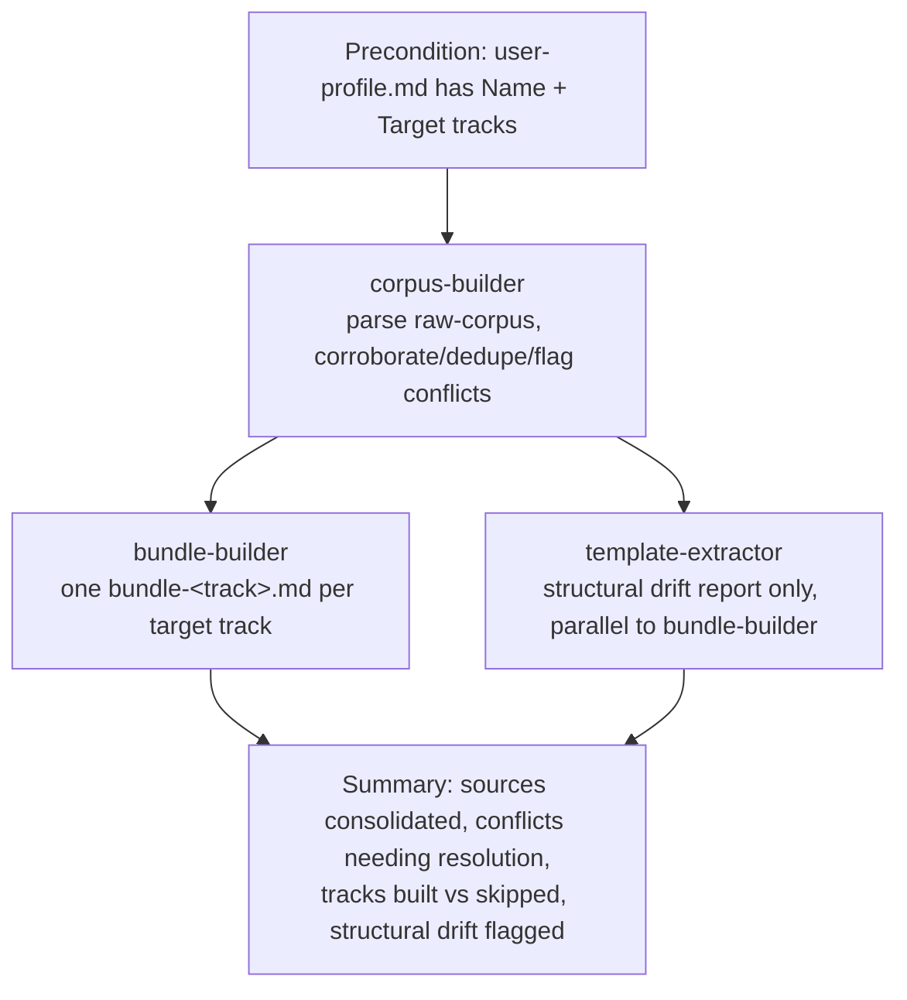

# Resume-Tailor Plugin — Architecture

Reference document for how this plugin is put together: skills, agents,
commands, data flow, and the workflows that tie them together. Written
2026-09-11, current as of plugin version 0.8.0. This is documentation,
not a spec — the authoritative rules live in `skills/*/SKILL.md` and
`agents/*.md`; this file explains how those pieces fit together and
should be updated (or flagged as stale) whenever a structural change is
made to the plugin, the same way `resume-format.md`'s baseline is
maintained deliberately rather than left to drift.

## What this plugin is

A human-in-the-loop resume and cover letter tailoring system, plus
company-specific interview prep, built as a Claude Code / Cowork plugin.
It is the companion to a separate, existing automated job-application
pipeline; this plugin is used for higher-stakes applications that
warrant gap dialogue and manual QA rather than a fully automated run.

Two governing design principles run through everything below:

1. **Accuracy over polish.** Nothing gets written into a resume or
   cover letter unless it traces back to a source document or a direct,
   confirmed answer from the candidate. See "The trust chain," below.
2. **Single source of truth per concept.** Formatting rules live in
   exactly one place (`resume-format.md` / `coverletter-format.md`),
   cross-cutting rules live in exactly one place (`constraints.md`), and
   a given application's state lives in exactly one file (the session
   file). Every agent is a reader/writer against these, not an
   independent source of judgment calls that could drift from them.

## Directory structure

```
Resume-tailor-plugin/
├── .claude-plugin/
│   ├── plugin.json           # skills/agents/commands manifest + version
│   └── marketplace.json      # local marketplace listing + version
├── skills/                   # canonical rule files (see below)
│   ├── constraints/SKILL.md
│   ├── resume-format/SKILL.md
│   ├── coverletter-format/SKILL.md
│   ├── ai-fingerprint-checklist/SKILL.md
│   ├── interview-prep-format/SKILL.md
│   ├── interview-plan-format/SKILL.md
│   └── known-gaps/SKILL.md
├── agents/                   # one .md per agent (13 total)
├── commands/                 # one .md per slash command (6 total)
├── user-data/                # candidate's own data — excluded from bundle
│   ├── reference/             # profile, master corpus, bundles, corrections
│   ├── raw-corpus/            # old resumes/cover letters, unprocessed
│   ├── applications/          # one session_<company>_<role>.md per JD
│   └── output/                # one <company>_<role>/ folder per JD
└── _backups/                 # timestamped pre-edit snapshots (this session's convention)
```

`excluded_from_bundle: ["user-data/"]` in `plugin.json` means the
candidate's actual data never ships as part of the plugin package —
only the rule files, agents, and commands do.

## Skills (7) — canonical rule files

Every skill lives at `skills/<name>/SKILL.md`. Legacy flat files at
`skills/<name>.md` existed alongside these and were the actual files
every agent prompt referenced until 2026-09-11 (see "Known issues fixed
this session" below) — they are now deprecated stubs, kept only because
they couldn't be deleted from this session, safe to delete manually.

| Skill | Covers |
|---|---|
| `constraints` | Cross-cutting non-negotiable rules: priority hierarchy (Accuracy > Relevance > Impact > ATS > Brevity), name sourcing, no em dashes, bullet-length cap, metric density, metric-context requirement, no repeated metrics, data-conflict protocol, metric-collision tiebreak, cover letter length, no fabrication, American English, pointer to `known-gaps`. |
| `resume-format` | Authoritative resume formatting spec: page setup, typography (Calibri throughout), color, alignment, section header borders, required section order (8 fixed sections), job heading/client-name format, bullet formatting, tagline rule, tiered bullet-count standard, lead-verb rotation + banned lead verbs, Work Authorization line, ATS compatibility, file naming convention. |
| `coverletter-format` | Cover letter structural spec: letterhead, ~200-word body, Re: line, opening/body/closing structure, Company Signal Line sourcing rule, no client names in body, no defensive objection paragraphs. |
| `ai-fingerprint-checklist` | Lexical/structural/formatting heuristics to catch AI-generated-sounding text (stock intensifiers, triplet padding, keyword-dumping, formulaic bullets, uniform bullet lengths, emoji/arrows, curly quotes, etc.). Applied by `critique-agent`. |
| `interview-prep-format` | Contract for the "what happens in the room" document: process overview, audience map, round-by-round breakdown, result-first (Headline → Effect → Rationale → Operations) answer framing. |
| `interview-plan-format` | Contract for the "how do I walk in ready" document: fixed 7-step build order (job analysis → company deep dive → story bank → question bank → the pitch → final polish → room pointer). |
| `known-gaps` | Standing register of claims the candidate is not confident making (e.g., in-progress certifications), paired with pre-approved phrasing for claims that are true but easy to overstate. Hard-constraint tier, same as `constraints`. |

## Agents (13)

| Agent | Triggered by | Reads | Writes |
|---|---|---|---|
| `intake-agent` | `/setup-profile` | old resumes (suggestions only) | `user-data/reference/user-profile.md` (sole owner) |
| `corpus-builder` | `/build-reference` (step 1) | `raw-corpus/*`, `user-profile.md`, `corrections-log.md` | `master-resume.md`, `master-metrics-vault.md`, `star-story-bank.md` |
| `template-extractor` | `/build-reference` (step 1b, parallel to bundle-builder) | `raw-corpus/old-resumes/` | `master-resume.md`'s Structural Observations section (drift report only, never `resume-format.md`) |
| `bundle-builder` | `/build-reference` (step 2, after corpus-builder) | `master-resume.md`, `master-metrics-vault.md`, `star-story-bank.md` | `user-data/reference/bundles/bundle-<track>.md`, one per target track |
| `job-analyzer` | `/tailor-application` (step 1) | JD (text/URL), selected bundle, `user-profile.md` | creates the session file; writes JD text, Track Selection, Requirement Mapping (MATCH/PARTIAL/GAP), Gap Dialogue Log |
| `company-research` | `/tailor-application` (parallel to job-analyzer, once company name known) | live web search | session file's Company Research section (verified-or-omit) |
| `resume-tailor` | `/tailor-application` (step 2, parallel to coverletter-writer) | session file, selected bundle, `corrections-log.md` | session file's Bullet Plan + JD Coverage Report; `output/<co>_<role>/resume.docx` |
| `coverletter-writer` | `/tailor-application` (step 2, parallel to resume-tailor) | session file, selected bundle's Cover-Letter Guide, Company Research section | session file's Cover Letter Plan; `output/<co>_<role>/cover_letter.docx` |
| `critique-agent` | `/tailor-application` (step 3, fresh context, after both drafts complete) | finished resume + cover letter docs, session file, bundles, reference files | session file's Critique Scores section (scored, tiered findings; no drafting authority) |
| `interview-prep` | `/interview-prep` | session file (if exists) or pasted JD/URL, reference files | `output/<co>_<role>/interview-prep.md` |
| `interview-plan` | `/interview-plan` | session file (if exists) or pasted JD/URL, reference files, `interview-prep.md` (pointer only) | `output/<co>_<role>/interview-plan.md` |
| `mock-interview` | direct invocation or `/schedule-mock-interview`'s fired task | `interview-plan.md`'s Question Bank | nothing persisted — live critique loop only |
| `notion-sync-agent` | **STUB — not wired in** | n/a | n/a — gated behind Step 7 validation (5+ real JDs) + staging DB + scoped connector access |

## Commands (6)

| Command | Orchestrates |
|---|---|
| `/setup-profile` | `intake-agent` — first-run entry point, populates `user-profile.md` |
| `/build-reference` | `corpus-builder` → (`template-extractor` ∥ `bundle-builder`, bundle-builder strictly after corpus-builder) |
| `/tailor-application` | `job-analyzer` → (`company-research` ∥ gap dialogue) → (`resume-tailor` ∥ `coverletter-writer`) → `critique-agent` (fresh context) → report |
| `/interview-prep` | `interview-prep` agent (logistics/process document) |
| `/interview-plan` | `interview-plan` agent (narrative/readiness document) |
| `/schedule-mock-interview` | creates scheduled tasks (via the host platform's trigger tool, never an in-session cron) that later fire `mock-interview` |

## The trust chain (why accuracy holds end to end)



Every claim that reaches a final document traces to exactly one of two
places: a corroborated (or user-confirmed) line in the master reference
files, or a direct answer the candidate gave during this session's gap
dialogue. `critique-agent` re-derives this traceability independently,
in a fresh context, rather than trusting the drafting agents' self-report
— this is what catches a sourcing failure that "looked fine" mid-draft.

## Core workflow: `/tailor-application`



Every run produces, in `user-data/applications/session_<company>_<role>.md`:
Job Description, Company Research, Track Selection, Requirement Mapping,
Gap Dialogue Log, Bullet Plan, JD Coverage Report, Cover Letter Plan,
Critique Scores. This session file is the single source of truth for
that application — every agent after `job-analyzer` reads from it rather
than re-deriving state, and the final report to the candidate is built
from it, not reconstructed from memory.

**Why resume-tailor and coverletter-writer run in parallel, not
sequentially:** both depend only on `job-analyzer`'s finished output,
not on each other — they coordinate metric-overlap (no repeated numbers
across the two documents) through the shared session file's Bullet Plan,
which coverletter-writer checks before finalizing, rather than through a
blocking handoff between the two agents.

**Why critique-agent must run in a fresh context:** the fresh read is
what catches things the drafting agents rationalized away mid-session —
this was a real, observed catch (a continuous-monitoring requirement
that both agents' self-reports missed) documented in this session's own
test run, not a theoretical concern.

## Reference-building workflow: `/build-reference`



`corpus-builder` has a cold-start fallback: if the raw corpus is empty or
unparseable, it runs a structured interview per target track instead of
fabricating content.

## Interview-readiness workflow

`/interview-prep` and `/interview-plan` are companions to the tailoring
pipeline, not part of it — neither writes to `user-data/reference/` or
produces a resume/cover letter, and both can run from a pasted JD/URL
even with no prior `/tailor-application` session for that company/role.

- `/interview-prep` → **logistics**: process overview, audience map,
  round-by-round breakdown ("what will happen in the room").
- `/interview-plan` → **narrative**: job analysis, company deep dive,
  story bank, question bank, the pitch, final polish ("what the
  candidate actually says"). Must run its 7 steps in fixed order —
  company research has to land before the pitch is drafted.
- `/schedule-mock-interview` → creates scheduled tasks (T-7d cold run,
  T-1/2d targeted run) that later fire `mock-interview` against the
  interview-plan's Question Bank. Uses the host platform's real
  scheduled-task tool, never an in-session cron (which would silently
  die when the session ends).
- `mock-interview` → live text-based Q&A and critique loop against
  Headline → Effect → Rationale → Operations; critiques delivery, never
  introduces new facts.

## Version and cache discipline

`plugin.json` and `marketplace.json` each carry their own `version`
field; they must be bumped **together, in the same change**, whenever
any agent, command, or skill file's content changes. A version left
unbumped (or the two files drifting out of sync with each other) is the
known failure mode that causes an edited file's content to not actually
take effect in a running/reinstalled session — observed directly in this
session before this document existed. After any content change:

1. Bump both `plugin.json`'s and `marketplace.json`'s `version` in the
   same commit.
2. Uninstall and reinstall the plugin, then confirm `claude plugin
   list` actually shows the new version before trusting a live run.
3. Start a fresh session before the next real run; reusing an
   already-open session has been observed to keep serving stale
   plugin content even after a correct reinstall.

**Confirmed 2026-09-11 — the CLI environment and git facts, resolved
end to end:**

- The `claude` CLI runs inside **WSL**, not native Windows. The plugin
  folder is `D:\CLAUDE\Resume-Tailor-Claude\Resume-tailor-plugin` from
  Windows, and `/mnt/d/CLAUDE/Resume-Tailor-Claude/Resume-tailor-plugin`
  from inside WSL — use the WSL path for every `claude plugin` command.
- `git status`/`add`/`commit` from a plain Windows PowerShell prompt at
  `D:\CLAUDE\Resume-Tailor-Claude` (the parent folder) fails with "not a
  git repository" — that's not the repo root. The actual repo root is
  `Resume-tailor-plugin` itself, one level down, with a real GitHub
  remote: `https://github.com/garynair/Resume-tailor-claude-plugin`
  (**public**).
- `claude plugin marketplace add` takes the **plugin repo root**, not
  the `.claude-plugin` subfolder — it appends `.claude-plugin/
  marketplace.json` itself. Passing the subfolder directly produces a
  "marketplace file not found" error with a doubled path.
- **The marketplace resolves from the local filesystem, not from the
  GitHub remote.** Verified directly: committing locally (no push) and
  running `claude plugin uninstall` → `marketplace add` → `install` →
  `claude plugin list` correctly showed the new version with nothing
  pushed to GitHub. A `git push` is good practice to keep `origin` from
  going stale, but it is not required for a version bump or content
  change to take effect locally.

## Known issues fixed 2026-09-11 (see `_backups/` for full diffs)

- **Legacy flat-file bug**: every agent/command prompt referenced
  `skills/<name>.md` (a legacy duplicate file), never the canonical,
  plugin.json-registered `skills/<name>/SKILL.md`. Fixed by repointing
  all 11 affected files; the 4 legacy files are now deprecation stubs.
- **job-analyzer over-triggering gap dialogue** on closely-adjacent,
  already-corroborated capabilities (e.g., asset-inventory tooling vs.
  M&A-specific integration work) — added an explicit "closely-adjacent
  capabilities are MATCH, not PARTIAL" rule.
- **Redundant manual cross-check** in `tailor-application.md`'s Step 3
  duplicated `critique-agent`'s existing Tier 1 duplicate-metric check —
  removed; critique-agent's independent pass is the single enforcement
  point now.
- **Style/voice rules added**: metric-context requirement (no bare
  percentages), banned lead verbs (Orchestrated, Leveraged, Facilitated,
  Championed), expanded approved lead-verb rotation, American English
  spelling standard, keyword-dumping heuristic.
- **`known-gaps` privacy split**: the skill previously stated the
  candidate's real certification status directly, which is a problem
  once the repo was confirmed public (see below). Split into a public
  `skills/known-gaps/SKILL.md` (mechanism only, no personal specifics)
  and a private `user-data/reference/known-gaps.md` (sibling directory,
  gitignored, holds the actual facts).
- **Public GitHub remote confirmed** on the `Resume-tailor-plugin` repo
  (`github.com/garynair/Resume-tailor-claude-plugin`, public). Anything
  committed here is visible to anyone; `user-data/` was confirmed never
  committed (`git log -- user-data/` returned nothing) and is gitignored
  going forward, same treatment now extended to the `known-gaps` split
  above.

## Open items

- **`marketplace.json`'s top-level `source` field** is literally the
  string `"..."`, not a real path — predates 2026-09-11's changes and
  still unexplained. Worth checking directly if the marketplace ever
  fails to resolve: a bare `"..."` may be a placeholder that was never
  filled in. Not blocking — the plugin's own `"source": "./"` entry
  resolves correctly regardless.
- **Notion sync**: intentionally disconnected from `/tailor-application`
  regardless of `user-profile.md`'s `notion_sync` setting, gated behind
  `notion-sync-agent.md`'s own activation criteria (Step 7 validation
  suite across 5+ real JDs, plus a staging database and scoped connector
  access). Next phase once the current fixes are confirmed stable.
- **Legacy flat skill files** (`constraints.md`, `resume-format.md`,
  `coverletter-format.md`, `ai-fingerprint-checklist.md`) are harmless
  deprecation stubs but not deleted — `device_bash` could not reach the
  repo folder this session (a Windows-update-related mount issue).
  Delete manually once convenient; nothing references them anymore.
